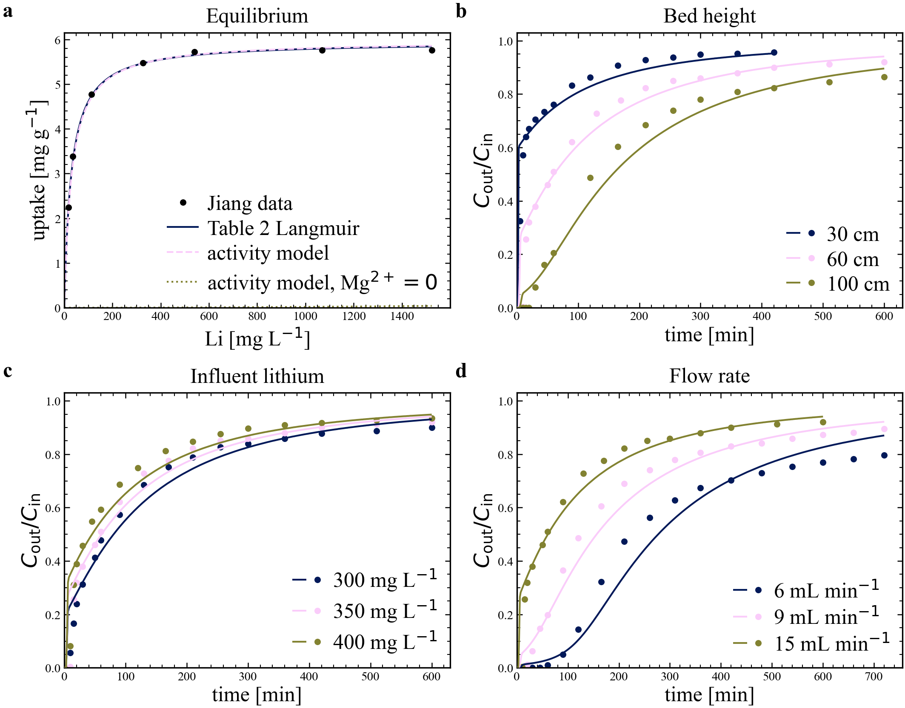

# Multi-ion ALLDH: activity isotherm and Jiang (2020) fixed-bed validation

Updated: 2026-08-20  
Model: [`Model/Multi_Ion_ALLDH/`](../../Model/Multi_Ion_ALLDH) — working tree
based on git commit `13011ba1`; the module itself is untracked at that commit.  
Source: Jiang et al., *Application of concentration-dependent HSDM to the
lithium adsorption from brine in fixed bed column*, Sep. Purif. Technol. **241**
(2020) 116682. PDF in
[`Model/Multi_Ion_ALLDH/`](../../Model/Multi_Ion_ALLDH).

## Bottom line

Two claims, and they are not equally strong.

**The equilibrium claim is strong.** Jiang's Table 2 Langmuir fit, written in
lithium *concentration*, can be re-expressed as a Langmuir in the *activity* of
an electroneutral LiCl–water insertion package without losing anything: SSE
`0.00831` mg²/g², R² `0.99930` over the seven digitized points, from a single
anchoring constant fixed at one concentration. Jiang's fit is recovered, not
approximated.

**The column claim is moderate, and its strength is not where the R² suggests.** Nine plotted breakthrough curves — three flow
rates, three bed heights, three inlet lithium concentrations — are reproduced at
RMSE `0.046`–`0.076` in `C_out/C_in` with **one global pseudo-second-order rate
constant** and no per-case adjustment. But those nine curves are seven distinct
experiments, three of them were used to fit that constant, and only four are
genuine out-of-sample predictions. Those four predict as well as the three
fitted ones (`0.050`–`0.076` vs `0.046`–`0.076`), which is the result worth
having, but this is not a no-fit validation, and all four out-of-sample cases
sit at the same 15 mL/min flow, so what they demonstrate is transfer across
geometry and feed concentration rather than across flow.

Crucially, **the RMSE and R² values are a weak test on this data**: a
two-parameter exponential fitted per curve beats the mechanistic model on seven
of nine curves. What the model does that no exponential can is predict the
breakthrough timescale of every experiment from one constant. Read the column
result as evidence of *parameter transfer*, not of goodness of fit. See
[How much do those numbers actually prove?](#how-much-do-those-numbers-actually-prove)
and [The k2 fit, reproduced and inspected](#the-k2-fit-reproduced-and-inspected).

Two structural caveats sit underneath both claims: `n_h2o` is **not identified**
by this dataset, and the Pitzer activities are evaluated at 298.15 K for
experiments run at 303 K. See [Limitations](#limitations).



## The model

### Equilibrium

Lithium enters the solid as an electroneutral package, not as a bare ion. The
aqueous side of the insertion reaction is characterised by one combined activity

```
A_aq = a_LiCl * a_w**n_h2o
```

and the loading is a Langmuir in that activity, evaluated in log space:

```
q_eq = q_max * sigmoid(ln K_i + ln A_aq)      [mol Li / kg sorbent]
     = q_max * K_i*A_aq / (1 + K_i*A_aq)
```

`q_max` is the **reversible loading span** above the regenerated solid endpoint,
not an absolute site inventory, and `n_h2o` is the **net** liquid-water
stoichiometric coefficient between the lower and upper solid endpoints per
inserted LiCl — not the hydration number of either endpoint. `a_LiCl` and `a_w`
come from the Pitzer–Kim model in [`utils/pitzer.py`](../../utils/pitzer.py),
which fixes temperature at 298.15 K and covers LiCl/NaCl/MgCl₂ only.

Because `A_aq` carries the whole brine, a background salt changes lithium uptake
without itself being sorbed. That is the point of the formulation, and the
`Mg²⁺ = 0` curve in the equilibrium panel is what it looks like: the same
calibrated `K_i`, evaluated in a magnesium-free solution, gives essentially zero
uptake (`9.1e-6` to `0.040` mg/g across the seven digitized concentrations). It is a
counterfactual illustrating the sensitivity, **not** a separate fit and not a
prediction anyone has measured.

#### Why that curve is flat at zero

The flat line reads as a modelling artefact and is not one, so it is worth
decomposing. `a_LiCl` is the activity of the neutral **LiCl salt**,
`γ±²·m_Li·m_Cl` — it needs chloride as much as it needs lithium. At the 350 mg/L
feed:

| Quantity | Jiang brine | Mg²⁺ = 0 | Ratio |
|---|---:|---:|---:|
| `m_Li` (mol/kg) | 0.05870 | 0.05043 | 1.16 |
| `m_Cl` (mol/kg) | 9.6367 | 0.05043 | **191** |
| Ionic strength (mol/kg) | 14.426 | 0.0504 | 286 |
| `γ±` (LiCl) | 13.659 | 0.8284 | 16.5 (`γ±²`: **272**) |
| `a_LiCl` | 105.54 | 0.001745 | 60,500 |
| `a_w` | 0.46129 | 0.99828 | 0.46 |
| `A_aq` | 48.684 | 0.0017423 | **27,900** |
| `K_i·A_aq` | 12.04 | 4.31e-4 | |
| `q` (mg/g) | 5.4956 | 0.00256 | |

Deleting the MgCl₂ removes two things at once. It removes **99.5% of the
chloride** (191×), because Mg supplies 9.58 of the 9.64 mol/kg. And it removes
the **ionic-strength enhancement of the activity coefficient** (`γ±²`, another
272×). Rising water activity pushes back only 2.2× the other way. The product is
a 27,900-fold collapse in the insertion driving force, and since `K_i` is
anchored so that `K_i·A_aq = 12` in the brine — deep in Langmuir saturation, θ =
0.92 — the counterfactual lands at θ = 4.3e-4.

Put the other way: **Jiang's brine at 350 mg/L Li has the same LiCl insertion
driving force as a pure LiCl solution about 79× more concentrated in lithium**
(4.62 vs 0.0587 mol/kg). The model is not saying magnesium promotes uptake
chemically; it is saying that in a chloride-form intercalation the chloride
activity and the ionic strength are half the driving force, and a dilute LiCl
solution has neither.

This is **not** an artefact of the unidentified `n_h2o`. Re-anchoring `K_i` at
each exponent and re-evaluating gives `q(Mg=0, 350 mg/L)` = 0.0012, 0.0026,
0.0055, 0.0259 mg/g for `n_h2o` = 0, 1, 2, 4 and 0.00025 mg/g at `n_h2o` = −2 —
negligible across the whole plausible range, because water activity moves by a
factor of 2 while chloride moves by a factor of 191.

What the curve does **not** support is the magnitude as a quantitative
prediction. It extrapolates a one-point-anchored `K_i` across 4.5 decades of
`A_aq`, and it leans on `γ±  = 13.7` at ionic strength 14.4 mol/kg from mixing
parameters the Pitzer module flags as unverified. Read it as "uptake collapses",
not as "uptake is 0.0026 mg/g". Separating the chloride-supply effect from the
Mg-specific one needs a matched-background comparison — `multi_ion_matched_background.svg`
in this directory does that at fixed added chloride and fixed added ionic
strength, over a physically attainable range.

### Column

One-dimensional plug flow on a uniform cell-centred finite-volume grid, upwind
advection, no axial dispersion term:

```
dc_i/dt = -(u_s/eps) * (c_i - c_i,upstream)/dx        i = LiCl, NaCl, MgCl2
dc_LiCl/dt += -((1-eps)*rho_p/eps) * dq/dt
dq/dt = k2 * (q_eq - q) * |q_eq - q|
```

Fluid concentrations are mol/m³ solution, loading is mol/kg sorbent, and `k2` is
kg sorbent/(mol Li·s). The absolute value makes the pseudo-second-order rate
sign-preserving so the same law runs desorption. NaCl and MgCl₂ are transported
but do not sorb; they act only through their Pitzer activities. Concentration is
converted to molality at the activity boundary alone.

Integration is Diffrax `Tsit5` with a PID controller at rtol `1e-5`, atol
`1e-8`, on `N = 40` cells.

## Calibration route

Nothing in the isotherm is regressed against the column curves.

1. **`q_max` is taken from Jiang Table 2 unchanged**: 5.9522 mg/g = 0.85767
   mol/kg.
2. **`K_i` is anchored at one point.** Jiang's Langmuir gives an affinity
   `K_s*C` at lithium concentration `C`; the activity form gives `K_i*A_aq`.
   Setting these equal at the column feed, `C_ref = 350` mg Li/L, fixes
   `ln K_i = ln(K_s * C_ref) - ln A_aq(C_ref) = -1.39740`, i.e. `K_i = 0.24724`.
   This is one equation for one unknown — the seven-point agreement below is
   therefore a test, not a fit.
3. **`n_h2o = 1` is assumed.** Jiang ran a single fixed MgCl₂ matrix, so water
   activity never varies independently of lithium activity and the exponent
   cannot be identified. It is an explicit input (`--n-h2o`), not a fitted
   parameter.
4. **`k2 = 1.00148162948e-4` kg/(mol·s)** is the one quantity fitted to column
   data: a pooled least-squares fit over the three Figure 4C flow-rate curves,
   then used unchanged for every height and inlet-concentration case. It enters
   as a module constant (`K_PSO_KG_MOL_S`) at the only two places `ColumnParams`
   is built, [`jiang_validation.py:235`](../../Model/Multi_Ion_ALLDH/jiang_validation.py)
   and [`:336`](../../Model/Multi_Ion_ALLDH/jiang_validation.py) — the flow cases
   and the height/inlet cases respectively — so every one of the nine runs uses
   the identical value.

### The k2 fit, reproduced and inspected

**The fitting code is not in this repository.** The constant is hardcoded with a
comment naming its provenance, and `LiteratureReview/isotherm_kinetics.json`
repeats that provenance in prose. Nothing reproduces it on demand.

Re-running the stated fit independently — Brent minimisation of the pooled SSE
over the three Figure 4C curves, same grid, same solver, same isotherm —
confirms it:

| | `k2` (kg/(mol·s)) | Pooled SSE |
|---|---:|---:|
| Repo constant | 1.001482e-4 | 0.200554 |
| Independent pooled minimiser | 1.000636e-4 | 0.200543 |

0.08% apart. The stated provenance is correct.

The per-curve optima are more interesting than the pooled one:

| Flow | Own best `k2` | SSE at own best | SSE at pooled `k2` |
|---|---:|---:|---:|
| 6 mL/min | 8.289e-5 | 0.0358 | 0.0625 |
| 9 mL/min | 9.636e-5 | 0.0381 | 0.0398 |
| 15 mL/min | 1.156e-4 | 0.0722 | 0.0982 |

**The best-fit rate constant increases monotonically with flow rate**, by a
factor of 1.39 across a 2.5× velocity range. An intrinsic rate constant cannot
do that. Fitting the exponent gives `k2 ∝ u^0.36`, and the same exponent holds
for both sub-intervals (0.37 for 6→9, 0.36 for 9→15). That is the signature of
**external film mass transfer**, whose coefficient goes as `u^(1/3)` in the
Wilson–Geankoplis correlation for low-Reynolds packed beds. The lumped `k2` is
absorbing a film resistance rather than measuring a solid-phase reaction rate.

This fixes what `k2` is: a **condition-averaged lumped coefficient**, not a
material property. The pooled value is a compromise that costs the extremes and
not the middle — the 9 mL/min curve sits essentially at its own optimum (SSE
0.0381 vs 0.0398) while 6 and 15 mL/min pay 75% and 36% in SSE. It also bounds
where the single constant has been shown to transfer: the height and
inlet-concentration cases were all run at 15 mL/min, so those four out-of-sample
predictions test transfer across geometry and feed, not across flow. Within the
6–15 mL/min range the pooled value holds every curve to RMSE ≤ 0.076, which is
the operating claim; quoting `k2` as an intrinsic rate outside that range is
not supported.

Brine composition follows from Jiang's fixed background: Mg²⁺ = 100 g/L as
MgCl₂ (4.7778 mol/kg water), brine density 1.253 kg/L, water inventory
859.13 kg/m³ solution by difference. At the 350 mg/L feed this gives
`a_LiCl = 105.54`, `a_w = 0.46129`, `q_eq = 5.4956` mg/g.

### Is anything fitted in the isotherm calibration?

No. `calibrate_isotherm` imports no optimiser — not scipy, not optax, not
jaxopt — and contains no iteration. `q_max` is copied from Table 2, `n_h2o` is a
function argument, and `log K_i` is a single closed-form line solving one
equation in one unknown exactly. `projection_sse` and `projection_r2` are
computed *after* the model exists, as diagnostics; nothing is adjusted to
improve them.

That leaves two free *choices* rather than free parameters. Neither was tuned to
flatter the result — in both cases a different choice would score better.

**The anchor concentration.** R² falls monotonically as the anchor moves up:

| Anchor (mg/L) | `K_i` | R² vs Langmuir | R² vs data |
|---:|---:|---:|---:|
| 35.48 | 0.25732 | **0.99988** | 0.99727 |
| 112.90 | 0.25480 | 0.99987 | 0.99705 |
| **350.00** (used) | **0.24724** | **0.99930** | **0.99582** |
| 1068.80 | 0.22559 | 0.99239 | 0.98682 |
| 1523.66 | 0.21283 | 0.98392 | 0.97693 |

350 mg/L is used because it is the column feed, not because it maximises
anything; anchoring at 35 mg/L would look better on both columns.

**The water stoichiometry.** Re-anchoring `K_i` at each `n_h2o`:

| `n_h2o` | `K_i` | R² vs Langmuir | R² vs data |
|---:|---:|---:|---:|
| −4.0 | 0.005164 | 0.99565 | 0.99086 |
| 0.0 | 0.11405 | 0.99881 | 0.99507 |
| **1.0** (used) | **0.24724** | **0.99930** | **0.99582** |
| 2.0 | 0.53597 | 0.99965 | 0.99645 |
| 4.0 | 2.5188 | **0.99999** | 0.99732 |
| 6.0 | 11.837 | 0.99982 | 0.99769 |

`n_h2o = 1` is not the maximiser either. More importantly, this table **is** the
non-identifiability, quantified: swinging `n_h2o` across ten units forces `K_i`
through a factor of 2300 while the projection R² moves by less than 0.005. The
data cannot see `n_h2o` at all, because `K_i` absorbs whatever it is set to. Any
apparent preference for large `n_h2o` here is well inside digitization noise and
should not be read as evidence for a hydration number.

One thing *is* fitted, upstream and by someone else: Jiang's `q_max` and `K_s`
are their own regression of their own batch equilibrium data. The chain contains
a fit — it was performed by the original authors against batch measurements, not
by this work against the column curves.

### Why a one-point anchor reproduces seven points

The activity of the LiCl package is close to proportional to lithium molality in
this fixed magnesium background, because chloride is supplied overwhelmingly by
MgCl₂ and barely moves as lithium varies:

| Li (mg/L) | m_LiCl (mol/kg) | a_LiCl | a_w | A_aq / m_LiCl |
|---:|---:|---:|---:|---:|
| 18.28 | 0.00306 | 5.22 | 0.4671 | 797 |
| 112.90 | 0.01890 | 32.74 | 0.4655 | 806 |
| 350.00 | 0.05870 | 105.54 | 0.4613 | 829 |
| 1068.80 | 0.18018 | 363.15 | 0.4487 | 904 |
| 1523.66 | 0.25770 | 558.66 | 0.4407 | 955 |

`A_aq` is super-linear in lithium by about 20% across the full range, but only
1% across `18`–`113` mg/L, which is exactly the region where the isotherm is
steep and sensitive. By the time the departure grows, `K_i*A_aq > 60` and the
surface is saturated, so the error is absorbed: at 1523.66 mg/L the activity
model gives 5.856 mg/g against Langmuir's 5.841, a 0.26% difference. The largest
relative gap is at the low end (2.238 vs 2.297 mg/g at 18.28 mg/L, −2.6%), and
there the activity model happens to land closer to the digitized point than
Jiang's own fit does.

This near-proportionality is also the reason the two claims above have different
strength. Within one fixed matrix the activity isotherm is nearly a
reparameterisation of the concentration Langmuir. Its added content — the
response to a *changed* background — is untested by this dataset.

## What the curves represent

- Filled dots are digitized markers from Jiang Figure 4A–C, redigitized from the
  embedded source figure. Black dots in the equilibrium panel are Figure 3,
  redigitized at 300 dpi.
- Each solid line is one deterministic simulation at that experiment's geometry,
  flow, and feed. Nothing is refitted per curve.
- The equilibrium panel's two smooth lines are Jiang's Table 2 Langmuir and the
  activity model, both evaluated on an 800-point grid (union of a linear and a
  log grid over `0`–`1523.66` mg/L) so the low-concentration knee is resolved.
  They are all but indistinguishable, which is the intended reading.
- **The 0.6 m / 15 mL/min / 350 mg/L run is the same experiment in all three
  breakthrough panels.** Nine plotted curves, seven distinct runs.

## Quantitative results

### The equilibrium panel compares a model to a model

The headline R² is **model against model**, and quoting it alone overstates the
case. All three comparisons at the seven digitized `C_e` points:

| Comparison | R² |
|---|---:|
| Activity model vs **Table 2 Langmuir** (what the projection SSE measures) | +0.99930 |
| Activity model vs **digitized data** | +0.99582 |
| Jiang's own Langmuir vs **digitized data** | +0.99741 |

The activity model is very slightly *worse* against the data than the fit it
reproduces, which is what it must be — it is a reparameterisation of that fit,
so it cannot beat it except by luck. The `0.99930` figure measures the success
of the reparameterisation, not agreement with experiment. SSE for that
projection is `0.00831` mg²/g².

| Panel | Case | Role | RMSE `C/C₀` | MAE `C/C₀` |
|---|---|---|---:|---:|
| Flow | 6 mL/min | fitted (k2 pool) | 0.0574 | 0.0438 |
| Flow | 9 mL/min | fitted (k2 pool) | 0.0458 | 0.0366 |
| Flow | 15 mL/min | fitted (k2 pool) | 0.0760 | 0.0378 |
| Height | 0.3 m | **prediction** | 0.0760 | 0.0386 |
| Height | 0.6 m | = 15 mL/min run | 0.0760 | 0.0378 |
| Height | 1.0 m | **prediction** | 0.0502 | 0.0417 |
| Inlet Li | 300 mg/L | **prediction** | 0.0584 | 0.0410 |
| Inlet Li | 350 mg/L | = 15 mL/min run | 0.0760 | 0.0378 |
| Inlet Li | 400 mg/L | **prediction** | 0.0747 | 0.0446 |

The four out-of-sample cases span `0.0502`–`0.0760`; the three fitted ones span
`0.0458`–`0.0760`. Transferring a single rate constant across a 3.3× range of
bed height and a 1.33× range of feed concentration costs nothing measurable.

### How much do those numbers actually prove?

Less than they look. R² against a flat mean is a weak baseline for a monotone
saturating curve — the variance it has to beat is mostly just the rise from 0 to
0.9. Fitting a trivial `C/C₀ = A(1 − e^{−t/τ})` **to each curve separately**:

| Case | Model (1 global param) | 1-param exp (per curve) | 2-param exp (per curve) |
|---|---:|---:|---:|
| Flow 6 mL/min | +0.9698 | +0.9498 | +0.9500 |
| Flow 9 mL/min | +0.9820 | +0.9761 | **+0.9850** |
| Flow 15 mL/min | +0.9380 | +0.9310 | **+0.9751** |
| Height 0.3 m | +0.9099 | +0.8168 | **+0.9304** |
| Height 1.0 m | +0.9794 | +0.9773 | **+0.9812** |
| Inlet 300 mg/L | +0.9633 | +0.9506 | **+0.9942** |
| Inlet 400 mg/L | +0.9352 | +0.9181 | **+0.9724** |

A one-parameter exponential nearly matches the mechanistic model everywhere, and
a two-parameter exponential **beats it on seven of nine curves**. These columns
are kinetically limited (see below), so they have no sharp front and no strong
inflection — almost any monotone saturating curve with the right timescale fits
them. **R² ≈ 0.95 here is not evidence that the mechanism is right.**

What the exponentials cannot do is predict τ. Each needs its own fitted τ — seven
free parameters for seven experiments — whereas the mechanistic model gets every
τ from one `k2` plus the geometry, velocity, and feed concentration. That
transfer, not the R², is the defensible claim of this validation. The flip side
is visible in the same table: the 2-param exponential wins because the
mechanistic model's *shape* is slightly wrong, the same early-high/late-low
signature quantified above.

Residuals are shape errors, not capacity errors. Mean signed bias is under
`0.012` in `C/C₀` for every case, but it is not flat across the curve:

| Case | Mean bias | Bias where `C/C₀ < 0.5` | Bias where `C/C₀ > 0.5` |
|---|---:|---:|---:|
| Flow 6 mL/min | −0.0067 | −0.0191 | +0.0072 |
| Flow 9 mL/min | −0.0090 | −0.0014 | −0.0145 |
| Flow 15 mL/min | +0.0113 | +0.0637 | −0.0172 |
| Height 0.3 m | +0.0044 | **+0.1427** | −0.0154 |
| Height 1.0 m | −0.0081 | +0.0115 | −0.0277 |
| Inlet 300 mg/L | +0.0035 | +0.0366 | −0.0197 |
| Inlet 400 mg/L | −0.0016 | +0.0655 | −0.0295 |

In seven of nine cases the model runs **high** through the lower half of the
curve and **low** through the upper half: it leaks lithium too readily at
startup, then lags the measured approach to saturation. The two exceptions are
the slowest flows, 6 and 9 mL/min, where the early bias is small or slightly
negative. The effect is strongest for the shortest bed — `+0.143` below the
half-height at 0.3 m, the shortest contact time and the case most exposed to the
inlet cell.

That signature is what a single lumped uptake state produces when the real
particle has an internal gradient: no resistance is available to hold lithium
back in the first moments, and the same constant is then too slow to finish the
approach. The near-zero mean bias is the two errors cancelling, not their
absence.

## Why these columns are kinetically limited

This is worth stating because it explains why every measured curve leaks lithium
from the first bed volume instead of showing a sharp front.

At the 350 mg/L feed, `q_eq = 0.79187` mol/kg and the bed holds
`(1-eps)*rho_p = 889.2` kg sorbent per m³ of bed, so equilibrium saturation
requires

```
BV_stoich = [(1-eps)*rho_p*q_eq + eps*c_feed] / c_feed = 14.3 bed volumes
```

which at 15 mL/min through the 0.6 m column (1 BV = 12.6 min) is about 180 min.
The pseudo-second-order half-loading time at the same conditions is

```
t_half = 1/(k2*q_eq) = 12,600 s = 210 min
```

The uptake timescale is *longer* than the stoichiometric fill time. The solid
never comes close to equilibrium with the passing brine, so the front is smeared
over the entire experiment and `C_out/C_in` reaches 0.9 while the bed is still
far from loaded. Any model with fast kinetics would produce a sharp front here
and fail completely; the agreement above is largely a test of `k2` and its
transferability, with the isotherm setting only the asymptote.

## Limitations

**Structural**

- `n_h2o = 1` is an assumption. One fixed MgCl₂ matrix cannot separate `a_LiCl`
  from `a_w`, so `K_i` and `n_h2o` are confounded here — measurably so: ten
  units of `n_h2o`, absorbed by a 2300× swing in `K_i`, change the projection R²
  by under 0.005. Any brine with a different water activity will expose the
  choice. Identifying it needs equilibrium data at two or more background
  compositions.
- The calibration is *conditional* on Jiang's background. `K_i` absorbs whatever
  the anchor point's activity model gets wrong.
- No axial dispersion term. The only dispersive mechanism is the numerical
  dispersion of first-order upwinding on 40 cells. That is a tuned-by-accident
  quantity: refining `N` will sharpen the fronts and degrade the fit.
- The pseudo-second-order law lumps film transfer and intraparticle diffusion
  into one constant. Jiang's own concentration-dependent HSDM resolves the
  particle; this model does not. A single lumped state is known to fail at short
  times when the particle Biot number is high. The per-flow `k2` optima above
  show the film component directly: the fitted constant scales as `u^0.36`, so
  it is calibrated to Jiang's velocity range rather than intrinsic to the
  material.
- `k2` is a hardcoded constant with no fitting script in the repository. The
  value has been verified against an independent refit (above), but that refit
  lives outside version control.
- MgCl₂ and NaCl are transported but never sorb, and no ion exchange, phase
  change, or solid-side non-ideality is represented.

**Thermodynamic**

- Pitzer activities are evaluated at **298.15 K**; Jiang ran at **303 K**. The
  model has no temperature dependence, so this error is folded into `K_i`.
- `m_MgCl2 = 4.778` mol/kg is inside the ~6 mol/kg single-salt range where
  `utils/pitzer.py` is documented to be reliable, but the total ionic strength
  is `14.3` mol/kg.
- **The Li–Mg mixing parameters are unverified.** `utils/pitzer.py` records that
  `_THETA_LIMG = 0.2198` and `_PSI_LIMGCL` have no reference to check against —
  PHREEQC's `pitzer.dat` carries no lithium mixing parameters at all. This brine
  is exactly a Li–Mg–Cl mixture, so those two numbers sit directly under
  `a_LiCl`. The related Na–Mg parameters in the same file are known to disagree
  with Harvie–Møller–Weare by a factor of 4.3, which is the reason to be
  suspicious of the unchecked ones.

**Data**

- Every experimental point is digitized from figures, including the equilibrium
  points. The Table 2 fit parameters are typeset values and are the more
  reliable target, which is why the projection R² is quoted against the fit
  rather than against the markers.
- Table 2 prints `b` in L/g, but Eq. (4), the plotted curve, and the numeric
  values all require L/mg. The value is used as L/mg.

## Files

Data stays in this directory; only figures are versioned.

| File | Contents |
|---|---|
| [`figures/v2/`](figures/v2/) | The validation figure, with [`MANIFEST.md`](figures/v2/MANIFEST.md) recording the configuration that produced it. [`figures/v1/`](figures/v1/) is the same run before the `JansPlottingStuff` restyle |
| `jiang_pso_metrics.json` | Calibrated parameters, feed activities, and every RMSE/MAE in the table above |
| `jiang_pso_isotherm_curve.csv` | The 800-point dense isotherm grid plotted in the equilibrium panel |
| `jiang_pso_isotherm_projection.csv` | The seven digitized points with Langmuir, activity-model, and Mg-free values |
| `jiang_pso_flow_data.csv` | Digitized Figure 4C markers, by flow rate |
| `jiang_pso_flow_trajectories.csv` | Simulated outlet ratio, LiCl activity, and mean loading vs BV and time |
| `jiang_pso_condition_data.csv` | Digitized Figure 4A–B markers, by height and inlet concentration |
| `jiang_pso_condition_trajectories.csv` | The same simulated quantities for those cases |
| `jiang_pso_flow_*.npz` | Full space–time fields: `c_LiCl`, `c_NaCl`, `c_MgCl2`, `q` on (401 times × 40 cells), plus `BV` and cumulative outlet lithium |
| `jiang_pso_height_*.npz`, `jiang_pso_influent_concentration_*.npz` | The same fields for the height and inlet-concentration cases |

The `.npz` space–time fields are **not committed** — they are ~2.2 MB of binary
that the command below regenerates in about 18 s. Everything the report quotes
lives in the committed CSV and JSON.

The `multi_ion_*.svg` and `multi_ion_*_sensitivity.csv` files in this directory
are **not** part of this validation. They come from
[`Model/Multi_Ion_ALLDH/plot_isotherms.py`](../../Model/Multi_Ion_ALLDH/plot_isotherms.py)
and from a separate sensitivity sweep, and predate the figure-versioning
convention.

## Reproducing

```bash
/opt/miniconda3/envs/ads_col/bin/python -m Model.Multi_Ion_ALLDH.jiang_validation
```

Takes about 18 s. Options: `--n-h2o` (default 1.0) to change the assumed water
stoichiometry, `--cells` (default 40), `--save-points` (default 401),
`--output-dir` (default this directory). The script writes the figure flat into
the output directory; filing it under the next `figures/vN` is a manual step, by
convention. Unit tests:

```bash
/opt/miniconda3/envs/ads_col/bin/python -m pytest Model/Multi_Ion_ALLDH/tests -q
```
